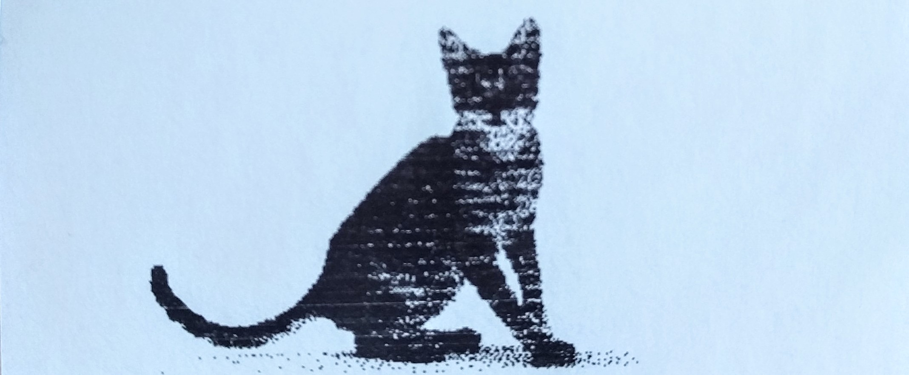

*CTTP* which stand for convert to thermal printer (file) is a tiny command line program to convert images files to data files which can by printed by a thermal printer. It also provide several builtin tools to manipultate input image.

# Table of content

<!-- TOC -->

- [Table of content](#table-of-content)
- [Prerequisites](#prerequisites)
    - [ImageMagick](#imagemagick)
    - [Ruby](#ruby)
    - [Bundler](#bundler)
- [CTTP](#cttp)
    - [Installation](#installation)
    - [Usage](#usage)
        - [In a file](#in-a-file)
        - [In memory](#in-memory)
        - [Arduino examples](#arduino-examples)

<!-- /TOC -->

# Prerequisites
## ImageMagick
Installation:
```
sudo apt install imagemagick libmagick++-dev
```

Verification:
```
$ convert --version
Version: ImageMagick 6.9.7-4 Q16 x86_64 20170114 http://www.imagemagick.org
```

## Ruby

Install `rbenv`:
```
curl -fsSL https://github.com/rbenv/rbenv-installer/raw/master/bin/rbenv-installer | bash
```

Add `rbenv` to path in `.bashrc` and install ruby (current latest 2.5.3):
```
echo 'export PATH="$PATH:$HOME/.rbenv/bin"' >> ~/.bashrc
echo 'eval "$(rbenv init -)"' >> ~/.bashrc
source ~/.basrc
rbenv install 2.5.3
```

## Bundler

Install bundler:
```    
gem install bundler
rbenv rehash
```

# CTTP
## Installation
```
git clone https://github.com/henricazottes/cttp.git
cd cttp/
bundle install
```

## Usage
```
$ ./cttp.rb -h
NAME
        cttp - convert image to (thermal) printable data

SYNOPSIS
        cttp FILE [OPTION]...

DESCRIPTION
        Convert To Thermal Printable data (cttp); Convert image file to black and white only and create data file printable by thermal printer.

        FILE: The file to convert.

        -h, --help
            show help

        -o filename, --output filename
            Save data in an ouput file named filename; must follow 8.3 format (8 max char name + 3 max char extension max) for arduino SD module compatibility
            Default filename is data

        -a, --array
            Print the data in a C++ array form like:
            data: {0x00, ...}

        -i, --info
            Print converted image dimensions and size

        -r x, --rotate x
            rotate the image by x degrees

        --flip_h
            flip the image horizontally

        --flip_v
            flip the image vertically
```

**Important**: Image size may be changed so the width is divisible by 8 for compatibility purpose with the printer. Use `-i` to output the final dimensions.

### In a file
Use `-o` to create a data file ready to be copied on an SD card. See example below to see how to print it.

### In memory
Use `-a` to output the data array. Copy and paste it in your arduino sketch as follow.

### Arduino examples

First run cttp with your image:
```
$ ./cttp.rb img_test.png -o -i -a
data:   {0xf0,0x01,0xf0,0x00,0xf0,0x00,0xf0,0x00,0x0f,0x00,0x0f,0x00,0x0f,0x00,0x0e,0x00,0x00,0xff,0x00,0xff,0x00,0xff,0x00,0xff,0x00,0xff,0x00,0xff,0x00,0xff,0x00,0xff}
size:   32 bytes
width:  16 px
height: 16 px
```
Note the image size and copy the data file to sd card / or copy the data array from terminal. Here is the arduino sketch to print it using [Adafruit library](https://github.com/adafruit/Adafruit-Thermal-Printer-Library):

```cpp
#include <Adafruit_Thermal.h>
#include <SD.h>
#include "SoftwareSerial.h"

#define TX_PIN 9 // Arduino transmit  YELLOW WIRE  labeled RX on printer
#define RX_PIN 8 // Arduino receive   GREEN WIRE   labeled TX on printer
#define SD_Pin 4

SoftwareSerial mySerial(RX_PIN, TX_PIN); // Declare SoftwareSerial obj first
Adafruit_Thermal printer(&mySerial);     // Pass addr to printer constructor

inline void initSD() {
  pinMode(SD_Pin, OUTPUT);
  if (!SD.begin(SD_Pin)) {
    Serial.println("SD Error");
  } else {
    Serial.println("SD Ok");
  }
}

void setup() {
  initSD();

  mySerial.begin(19200);  // Initialize SoftwareSerial
  printer.begin();        // Init printer (same regardless of serial type)

  // From file on SD card
  File data = SD.open("data", FILE_READ);
  printer.printBitmap(16, 16, dynamic_cast<Stream*>(&data));
  data.close();
  printer.feed(2);

  // From array directly in memory
  const uint8_t test[] = {0xf0,0x01,0xf0,0x00,0xf0,0x00,0xf0,0x00,0x0f,0x00,0x0f,0x00,0x0f,0x00,0x0e,0x00,0x00,0xff,0x00,0xff,0x00,0xff,0x00,0xff,0x00,0xff,0x00,0xff,0x00,0xff,0x00,0xff};
  printer.printBitmap(16, 16, test);
  printer.feed(2);

  printer.sleep();      // Tell printer to sleep
  delay(3000L);         // Sleep for 3 seconds
  printer.wake();       // MUST wake() before printing again, even if reset
  printer.setDefault(); // Restore printer to defaults
  
}

void loop() {
}
```
